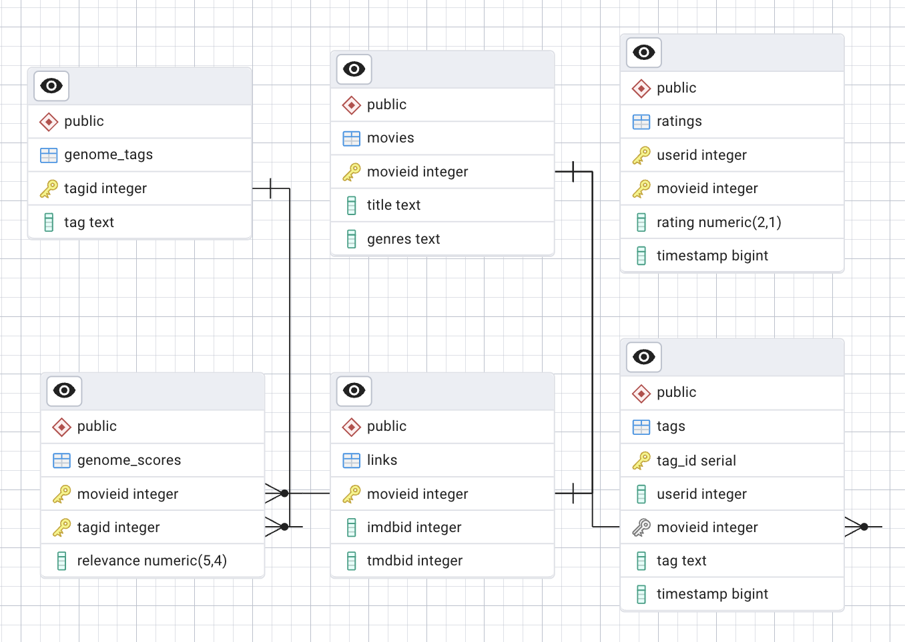

# 🎬 KinoAnalytics LLC — Аналитика данных о фильмах  

## 📌 Компания  
**KinoAnalytics LLC** — платформа анализа данных о фильмах, помогающая выявлять предпочтения пользователей и тенденции в индустрии кино.  

Я — аналитик данных в компании **KinoAnalytics LLC**. 
Проект: исследование кинопроизведений (качество, доходы, жанры, актёры) на основе MovieLens + TMDB метаданных.  
Моя задача — анализировать данные о фильмах, выявлять тенденции в поведении пользователей и предоставлять бизнесу рекомендации для принятия решений на основе данных.

---

## 📊 О проекте  
Этот проект посвящён аналитике пользовательских оценок фильмов.

Мы исследуем:

Какие фильмы и жанры наиболее популярны?

В какие периоды активность пользователей максимальна?

Какие теги и темы встречаются чаще всего?

Как меняются предпочтения зрителей со временем?

---

## 🖼️ Визуализация  


---

## ⚙️ Как запустить проект  

### 1. Установить PostgreSQL и создать базу  
    sql
    CREATE DATABASE movies_db;
### 2. Импортировать таблицы (в порядке)
   #### 📦 Датасет
Полный датасет слишком большой для хранения на GitHub.  
Вы можете скачать его отсюда:  
[Popular Movies Datasets - 58098 Movies (Kaggle)](https://www.kaggle.com/datasets/whenamancodes/popular-movies-datasets-58000-movies)
   
   #### После скачивания поместите файлы в папку `dataset/`   
   - genome-scores
   - genome-tags
   - links
   - movies
   - ratings
   - tags

### 3. Запустить Python-скрипт для анализа
 #### 1. Создать и активировать окружение:
    python -m venv venv
    venv\Scripts\activate 
 #### 2.Установить зависимости:
    pip install -r requirements.txt

 #### 3.Запустить скрипт:
    python main.py
    
---

### 🛠 Инструменты и ресурсы
 - PostgreSQL 17 — хранение и обработка данных
 - Python: pandas, psycopg2, matplotlib, plotly — анализ и визуализации
 - Apache Superset — интерактивные дашборды
 - Power BI — отчёты и бизнес-аналитика
 - pgAdmin — схема базы данных (ERD)
 - Dataset: Popular Movies Datasets - 58098 Movies (Kaggle)

---

### Проверка что данные реально меняются
   #### Запрос для проверки
      INSERT INTO ratings (userid, movieid, rating, timestamp)
      VALUES (99999, 1, 0.5, EXTRACT(EPOCH FROM NOW()));  -- фильм с movieid=1, низкая оценка


---

### 📂 Структура репозитория
```
├── images/              # скриншоты аналитики
├── output/              # сохраненные результаты (csv, графики)
├── queries.sql          # SQL-запросы
├── main.py              # Python-скрипт для подключения к БД
├── analytics.py         # аналитика + визуализации + экспорт
├── config.py            # конфигурация подключения к БД
├── charts/              # папка для графиков
├── exports/             # папка для Excel
├── requirements.txt     # список Python-зависимостей
├── README.md            # описание проекта
```